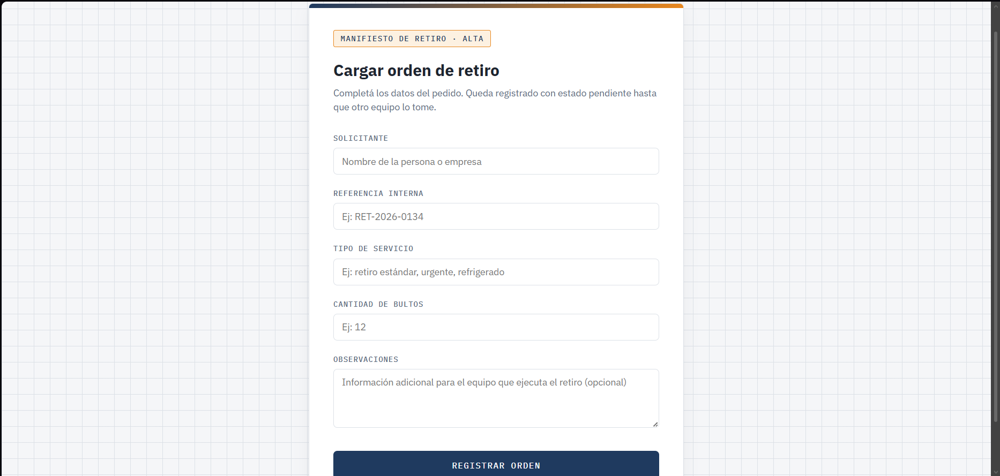
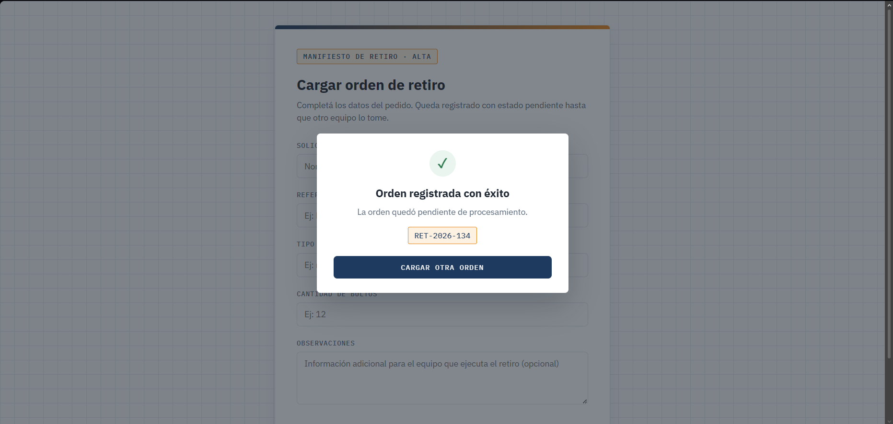
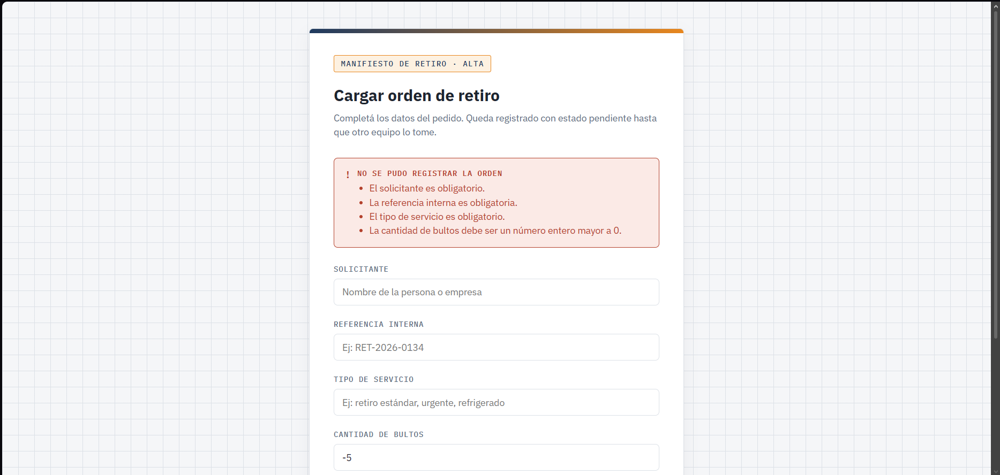

## Preview




## Acerca del proyecto

Implementé una funcionalidad concreta usada por operadores logísticos urbanos que trabajan con empresas que necesitan coordinar retiros diarios de mercadería. Este tipo de negocio recibe pedidos durante el día y los procesa más tarde para armar recorridos, asignar vehículos y planificar cargas.

La funcionalidad permite que un operador administrativo cargue un pedido de retiro desde una interfaz web simple. El sistema debe registrar ese pedido de forma persistente y dejarlo listo para que otro equipo lo tome y lo ejecute. El valor está en que el pedido no se pierde, queda identificado y puede ser consultado más adelante.

La entidad principal es una orden de retiro. Representa una instrucción operativa pendiente. Guarda quién solicita el retiro, una referencia interna para identificarlo, el tipo de servicio requerido, la cantidad de bultos, observaciones libres y un estado inicial que indique que la orden todavía no fue procesada.

El sistema expone una pantalla HTML con un formulario. Entrar a esa pantalla solo muestra la interfaz. No se crea nada. Esa interacción ocurre mediante una request GET y sirve para preparar la carga.

Cuando el formulario se envía, la intención cambia. La request pasa a ser POST y expresa que se quiere registrar una orden nueva. La view recibe los datos desde request.POST, los agrupa y verifica que la información mínima esté presente. Si faltan datos esenciales, el sistema vuelve a mostrar la pantalla con un mensaje claro. Si los datos son suficientes, la orden se guarda en persistencia con estado “pendiente” y se muestra una confirmación.

El flujo es intencionalmente simple y explícito. Un endpoint GET para mostrar el formulario. Un endpoint POST para crear la orden. Ninguna navegación modifica estado. Ninguna creación ocurre fuera del POST.

La implementación usa views basadas en funciones, formularios HTML con CSS, JS y templates con contexto explícito. No se usan Django Forms ni frameworks externos. La lógica de negocio se mantiene fuera del renderizado. La respuesta siempre es HTML.

Este integrador me permite conectar todo lo aprendido hasta ahora en una sola pieza funcional: rutas, views, request y response, templates, formularios, métodos HTTP y persistencia básica. El foco está en entender cómo una necesidad puntual del negocio se traduce en una funcionalidad concreta, acotada y útil dentro de un sistema real.

## Configuración del proyecto

Este proyecto utiliza variables de entorno para gestionar datos sensibles (como `SECRET_KEY` y credenciales de base de datos), evitando exponerlos en el control de versiones.

### Requisitos previos

- Python 3.x
- pip

### Instalación

1. Cloná el repositorio:
```bash
   git clone https://github.com/luccamaidana/orden-retiro-django
   cd orden-retiro-django
```

2. Creá y activá un entorno virtual:
```bash
   python -m venv venv
   source venv/bin/activate  # En Windows: venv\Scripts\activate
```

3. Instalá las dependencias:
```bash
   pip install -r requirements.txt
```

4. Creá un archivo `.env` en la raíz del proyecto, usando `.env.example` como referencia, y completá tus propios valores:

5. Ejecutá el servidor de desarrollo:
```bash
   python manage.py runserver
```

### Seguridad

Las credenciales y claves sensibles se gestionan mediante `python-decouple` y un archivo `.env` (excluido del repositorio vía `.gitignore`), siguiendo buenas prácticas de seguridad en proyectos Django.